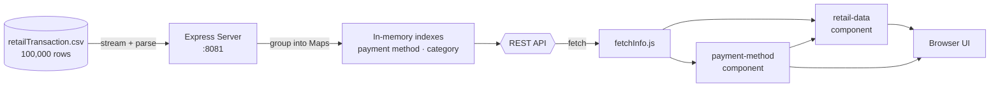

<div align="center">

# Retail Transaction Dashboard 🛒

### A full-stack data explorer for 100,000 retail transactions, built with Node.js, Express and native Web Components.

<br/>


<br/>

[Features](#-features) •
[Tech Stack](#-tech-stack) •
[Architecture](#-architecture) •
[Getting Started](#-getting-started) •
[API Reference](#-api-reference) •
[Project Structure](#-project-structure)

</div>

---

## Overview

**Retail Transaction Dashboard** is a full-stack web application that loads a **100,000-row retail dataset** into memory on server start-up, indexes it for fast lookups, and serves it through a lightweight REST API. The front end consumes that API and renders results as reusable **custom HTML elements** built with the Web Components standard, with no front-end framework required.

Users can browse a sample of transactions, or drill into the **top 5 highest-value transactions** for each payment method.

---

## Features

| | Feature | Description |
|---|---|---|
| 📊 | **Dashboard landing page** | Card-based navigation to each data view |
| 🧾 | **Transaction browser** | First 5 records, sorted by Customer ID |
| 💳 | **Payment-type explorer** | Dropdown filter showing the top 5 transactions by total amount for **Cash, Credit Card, Debit Card** and **PayPal** |
| 🧩 | **Reusable Web Components** | `<retail-data>` and `<payment-method>` custom elements with encapsulated styles (Shadow DOM) |
| ⚡ | **Fast in-memory indexing** | Data pre-grouped by payment method and product category at start-up |
| 🌐 | **RESTful JSON API** | Clean, slug-based endpoints with CORS enabled |
| 📱 | **Responsive layout** | 3-column → 2-column → 1-column grid via CSS media queries |
| 🔄 | **Loading and error states** | Feedback while fetching, plus graceful failure handling |

---

## Tech Stack

<div align="center">

| Layer | Technology |
|:---:|:---|
| **Runtime** |  |
| **Server** |   |
| **Data parsing** |  streaming CSV reader |
| **Front end** |    |
| **UI pattern** | Web Components (Custom Elements, Shadow DOM, HTML Templates) |
| **Icons** |  |

</div>

---

## Architecture



**How the data flows**

1. On start-up, the server **streams** the CSV and builds a record for each row.
2. Each record is added to a full list **and** to `Map`s grouped by payment method and product category.
3. Payment method and category names are converted to **URL slugs** (e.g. `Credit Card` → `credit-card`).
4. The front end fetches from the API, sorts and slices results client-side, and renders `<retail-data>` cards.

---

## Getting Started

### Prerequisites


### Installation

```bash
# 1. Clone the repository
git clone https://github.com/<your-username>/<your-repo>.git
cd <your-repo>

# 2. Install dependencies
npm install express cors csv-parse

# 3. Start the server
node server
```

The server will print `Example app listening at http://127.0.0.1:8081` once the CSV is loaded.

### Open the app

Visit **http://localhost:8081/** and open `index.html`, or navigate directly to:

| Page | Path |
|---|---|
| Dashboard | `/index.html` |
| Retail Transactions | `/retailTransaction.html` |
| By Payment Type | `/paymentMethod.html` |

> ⚠️ The CSV must be located at `./server/data/retailTransaction.csv`, and the server must be started from the project root.

---

## API Reference

**Base URL:** `http://localhost:8081`

| Method | Endpoint | Description | Example |
|:---:|---|---|---|
| `GET` | `/retailData5` | First 5 transaction records | `/retailData5` |
| `GET` | `/paymentMethod` | Unique payment methods as `[name, slug]` pairs, sorted A→Z | `/paymentMethod` |
| `GET` | `/productCategory` | Unique product categories as `[name, slug]` pairs, sorted A→Z | `/productCategory` |
| `GET` | `/byPaymentMethod/:paymentMethod` | All transactions for a payment method slug | `/byPaymentMethod/credit-card` |
| `GET` | `/byProductCategory/:productCategory` | All transactions for a category slug | `/byProductCategory/home-decor` |

<details>
<summary><b>📦 Example response: <code>GET /paymentMethod</code></b></summary>

```json
[
  ["Cash", "cash"],
  ["Credit Card", "credit-card"],
  ["Debit Card", "debit-card"],
  ["PayPal", "paypal"]
]
```

</details>

<details>
<summary><b>📦 Example transaction record</b></summary>

```json
{
  "no": "1",
  "customerID": "109318",
  "productID": "C",
  "quantity": "7",
  "price": 80.07984415,
  "transactionDate": "12/26/2023 12:32",
  "paymentMethod": "Cash",
  "storeLocation": "176 Andrew Cliffs, Baileyfort, HI 93354",
  "productCategory": "Books",
  "discountAppliedInPercentage": 18.6770995,
  "totalAmount": 455.8627638
}
```

</details>

---

## Dataset

The dataset contains **100,000 retail transactions** spanning four product categories and four payment methods.

| Field | Description |
|---|---|
| `customerID` | Unique customer identifier |
| `productID` | Product identifier |
| `quantity` | Units purchased |
| `price` | Unit price |
| `transactionDate` | Date and time of purchase |
| `paymentMethod` | Cash · Credit Card · Debit Card · PayPal |
| `storeLocation` | Store address |
| `productCategory` | Books · Clothing · Electronics · Home Decor |
| `discountAppliedInPercentage` | Discount applied to the sale |
| `totalAmount` | Final amount after discount |

---

## Project Structure

```text
.
├── server.js                    # Express server and API
├── server/
│   └── data/
│       └── retailTransaction.csv    # 100k-row dataset
└── webpage/
    ├── index.html               # Dashboard landing page
    ├── retailTransaction.html   # First 5 transactions view
    ├── paymentMethod.html       # Payment-type filter view
    ├── style.css                # Global styles
    └── js/
        ├── main.js              # Page bootstrap and data loading
        ├── fetchInfo.js         # API fetch helpers
        ├── retailInfo.js        # <retail-data> Web Component
        └── paymentInfo.js       # <payment-method> Web Component
```

---

## Technical Highlights

- **Streaming CSV ingestion.** The file is read as a stream instead of loaded into memory in one go.
- **Slug-based routing.** `toSlug()` normalises names into clean, URL-safe identifiers.
- **Map-based indexing.** Grouping happens once at start-up, so filter requests return instantly.
- **Encapsulated components.** Each custom element owns its markup and styles through Shadow DOM, so styles never leak.
- **Attribute-driven rendering.** `<retail-data>` uses `observedAttributes` and `attributeChangedCallback` to update the DOM reactively.
- **Modular ES6 code.** Data fetching, components and page logic live in separate modules.
  
---

<div align="center">

⭐ **Thanks for checking it out!** ⭐

</div>
